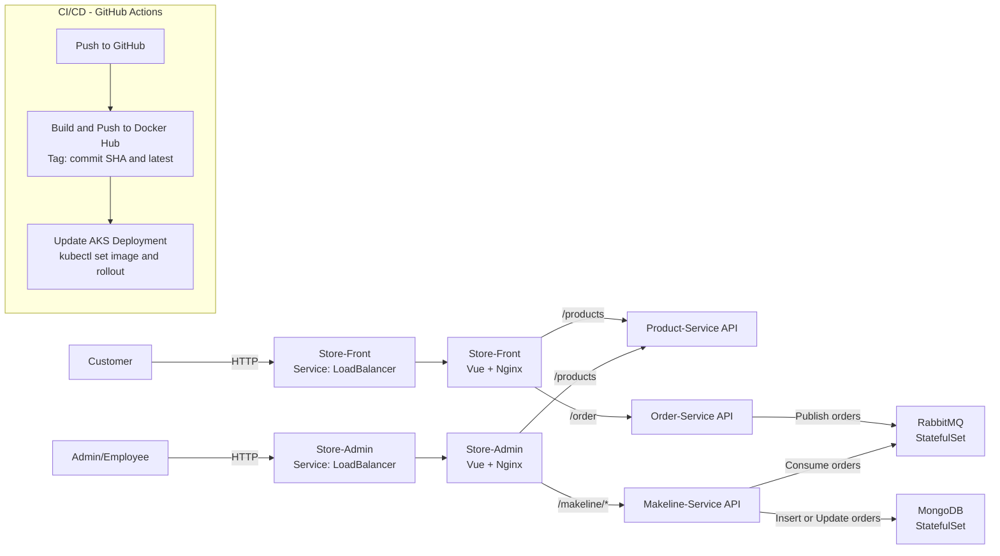

# Lab Project: Cloud-Native App for Best Buy

## Updated Architecture Diagram

---

## Brief Application Explanation

This project is a **cloud-native microservices retail application** deployed on **Azure Kubernetes Service (AKS)**. It simulates a BestBuy-style online store with two user interfaces: a **Store-Front** for customers and a **Store-Admin** for employees.

On the customer side, the **Store-Front** provides a **dynamic menu bar** that allows users to switch between different product categories such as **phones, laptops, and TVs**. Customers can browse products by category and place orders through the frontend interface.

The backend consists of independent microservices. The **Product Service** manages product data, the **Order Service** handles customer orders, and the **Makeline Service** processes orders asynchronously. Orders are published to **RabbitMQ** to decouple order intake from processing, improving scalability and resilience. Processed orders are stored in **MongoDB** for persistence.

On the admin side, the **Store-Admin** interface includes a dedicated **order management page** where administrators can **ship products**, updating order status as part of the fulfillment workflow.

All services are containerized using **Docker** and orchestrated with **Kubernetes**. A **GitHub Actions CI/CD pipeline** automatically builds Docker images, pushes them to **Docker Hub**, and deploys updates to AKS, demonstrating modern DevOps and cloud-native best practices.

---

## Deployment Instructions

### Prerequisites

* Azure account with an existing **AKS cluster**
* `kubectl` configured for the cluster
* Docker Hub account
* GitHub repository with Actions enabled

---

### Configure Kubernetes Access

```bash
az aks get-credentials \
  --resource-group <resource-group> \
  --name <aks-cluster-name>
```

---

### Deploy Infrastructure Components

```bash
kubectl create namespace bestbuy
kubectl apply -f k8s/rabbitmq.yaml -n bestbuy
kubectl apply -f k8s/mongodb.yaml -n bestbuy
```

---

### Deploy Application Services

```bash
kubectl apply -f k8s/product-service.yaml -n bestbuy
kubectl apply -f k8s/order-service.yaml -n bestbuy
kubectl apply -f k8s/makeline-service.yaml -n bestbuy
kubectl apply -f k8s/store-front.yaml -n bestbuy
kubectl apply -f k8s/store-admin.yaml -n bestbuy
```

---

### CI/CD Deployment (Recommended)

Once configured, **any push to the `main` branch** triggers:

* Docker image build
* Push to Docker Hub
* Automatic deployment to AKS

No manual redeployment is required.

---

### Verify Deployment

```bash
kubectl get pods -n bestbuy
kubectl get svc -n bestbuy
```

---

## 🔗 Links Table

| Service                            | GitHub Repository                                                                            | Docker Hub Image                                                                                                     |
| ---------------------------------- | -------------------------------------------------------------------------------------------- | -------------------------------------------------------------------------------------------------------------------- |
| Store-Front                        | [https://github.com/soufianemouss/store-front-l8](https://github.com/soufianemouss/store-front-l8)           | [https://hub.docker.com/r/soufianealgonquin/store-front-l8](https://hub.docker.com/r/soufianealgonquin/store-front-final)           |
| Store-Admin                        | [https://github.com/soufianemouss/store-admin-l8](https://github.com/soufianemouss/store-admin-l8)           | [https://hub.docker.com/r/soufianealgonquin/store-admin-l8](https://hub.docker.com/r/soufianealgonquin/store-admin-final)           |
| Product Service                    | [https://github.com/soufianemouss/product-service-l8](https://github.com/soufianemouss/product-service-l8)   | [https://hub.docker.com/r/soufianealgonquin/product-service-l8](https://hub.docker.com/r/soufianealgonquin/product-service-final)   |
| Order Service                      | [https://github.com/soufianemouss/order-service-l8](https://github.com/soufianemouss/order-service-l8)       | [https://hub.docker.com/r/soufianealgonquin/order-service-l8](https://hub.docker.com/r/soufianealgonquin/order-service-final)       |
| Makeline Service                   | [https://github.com/soufianemouss/makeline-service-l8](https://github.com/soufianemouss/makeline-service-l8) | [https://hub.docker.com/r/soufianealgonquin/makeline-service-l8](https://hub.docker.com/r/soufianealgonquin/makeline-service-final) |

---

## Demo Video
[Demo Video](https://www.awesomescreenshot.com/video/47377343?key=7db93d385e257dcfbf2c0c7c8abc1e19)
